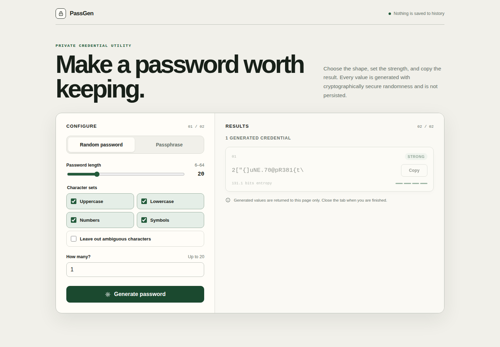

# 🔐 PassGen

**Generate strong random passwords and memorable passphrases from a polished web interface or a practical Python CLI.**

[](https://github.com/dk3yyyy/password-generator/actions/workflows/ci.yml)
[](https://www.python.org/)
[](LICENSE)

PassGen uses Python's `secrets` module for cryptographically secure randomness. The web interface does not persist generated values, while CLI history is disabled unless you explicitly enable it with `--save-history` or confirm the interactive prompt.

## 🖥️ Web interfaces



*The screenshot shows a generated sample; it is not a real credential.*

PassGen includes two web implementations:

- **Static browser demo (`docs/`)** — deployable to GitHub Pages with no backend. It uses the Web Crypto API, keeps generated credentials in tab memory only, and loads the bundled EFF wordlist from the same origin.
- **FastAPI interface (`web.py`)** — demonstrates the Python generator through a local server while preserving the same limits and entropy model.

Both interfaces provide:

- Random-password and passphrase modes
- Responsive layouts for desktop and mobile
- Keyboard-accessible controls and inline validation
- Strength and entropy indicators
- One-click copy with a manual-copy fallback
- Generation limits aligned with the CLI

For random passwords, displayed entropy is `log₂` of the exact number of valid outputs for the selected character classes after ambiguity filtering and exclusions. Passphrase entropy is based on independent choices from the configured wordlist. These estimates describe the generator's search space, not resistance to credential leaks, phishing, or implementation compromise.

## ✨ Features

### CLI

- Customizable uppercase, lowercase, number, and symbol sets
- Ambiguous-character exclusion and custom exclusions
- Memorable passphrases from EFF's 7,776-word list with configurable separators
- Interactive prompts and a quick-generation mode
- Strength analysis and weak-pattern warnings
- Optional clipboard copy
- Explicitly opt-in local history
- JSON or CSV history export
- Saved defaults, categories, and custom wordlists

### Security defaults

- Random choices use Python's `secrets` module.
- Passphrases default to six independently selected EFF words (about 77.5 bits).
- The web interface returns generated values only to the current page and does not write them to history.
- CLI history is written only when `--save-history` is supplied or the interactive save prompt is confirmed with `Yes`, `yes`, `y`, or `Y`; `No`, `no`, `N`, `n`, and an empty response decline.
- History and exports receive owner-only permissions on POSIX systems.
- Custom wordlists are constrained to PassGen's local wordlist directory.

> [!IMPORTANT]
> Saved history and exports contain plaintext passwords. Treat those files as sensitive and delete them when they are no longer needed. PassGen is a generator, not a password manager.

## 🚀 Quick start

### Requirements

- Python 3.14+
- [`uv`](https://docs.astral.sh/uv/)

### Install

```bash
git clone https://github.com/dk3yyyy/password-generator.git
cd password-generator
uv sync --all-extras
```

### Preview the static browser demo

```bash
python -m http.server 8000 --directory docs
```

Open [http://127.0.0.1:8000](http://127.0.0.1:8000). Serving the directory is required because browsers do not allow the passphrase wordlist to be fetched reliably from a `file://` page.

### Start the FastAPI interface

```bash
uv run python web.py
```

Open [http://127.0.0.1:8000](http://127.0.0.1:8000).

### Use the CLI

```bash
# Interactive mode
uv run python main.py

# 20-character password using every character class
uv run python main.py --length 20 --upper --lower --digits --symbols

# Six-word capitalized passphrase
uv run python main.py --passphrase --words 6 --capitalize

# Generate and copy one strong 20-character password
uv run python main.py --quick

# Explicitly save this result to local history
uv run python main.py --length 20 --upper --lower --digits --symbols --save-history
```

Interactive mode returns to the main menu after each action. Enter `q` from the menu to quit.

## 🧰 CLI reference

| Flag | Description | Default |
|---|---|---:|
| `--length N` | Password length | `12` |
| `--upper` | Include uppercase letters | Off |
| `--lower` | Include lowercase letters | Off |
| `--digits` | Include numbers | Off |
| `--symbols` | Include symbols | Off |
| `--no-ambiguous` | Exclude `0`, `O`, `l`, `1`, and `I` | Off |
| `--exclude CHARS` | Exclude specific characters | `""` |
| `--count N` | Number of passwords to generate | `1` |
| `--copy` | Copy the generated value | Off |
| `--interactive` | Force interactive mode | Off |
| `--passphrase` | Generate a passphrase | Off |
| `--words N` | Number of passphrase words | `6` |
| `--separator SEP` | Separator between words | `-` |
| `--capitalize` | Capitalize passphrase words | Off |
| `--add-number` | Append a number to the passphrase | Off |
| `--category NAME` | Label a saved history entry | `""` |
| `--wordlist NAME` | Use a custom local wordlist | `""` |
| `--history` | Display saved history | — |
| `--save-history` | Save generated values to local history | Off |
| `--clear-history` | Delete saved history | — |
| `--export json\|csv` | Export saved history | — |
| `--save-config` | Save the current options as defaults | Off |
| `--config` | Load saved defaults | Off |
| `--quick` | Generate and copy one strong 20-character password | Off |
| `--version` | Display the PassGen version | — |

## 🗂️ Local data

PassGen stores optional local state under `~/.passgen/`:

```text
~/.passgen/
├── config.json
├── history.json
└── wordlists/
```

Generated values are not written there unless you explicitly use `--save-history`.

## 🧪 Development

```bash
# Install project and development dependencies
uv sync --all-extras

# Run the Python test suite
uv run pytest tests/ -v

# Install and run the static browser tests (Node.js 20+)
npm ci
npx playwright install chromium
npm test

# Verify the GitHub Pages wordlist matches the Python source
cmp wordlists/eff_large_wordlist.txt docs/eff_large_wordlist.txt

# Compile-check the Python entry points
uv run python -m py_compile main.py web.py passphrases.py passwords.py
```

For pull requests targeting `main`, GitHub Actions runs the test suite and a non-blocking Python compilation check.

## 📁 Project structure

```text
password-generator/
├── .github/workflows/ci.yml
├── docs/
│   ├── index.html
│   ├── styles.css
│   ├── app.mjs
│   ├── generator.mjs
│   ├── eff_large_wordlist.txt
│   └── web-ui.png
├── main.py
├── passphrases.py
├── passwords.py
├── web.py
├── templates/index.html
├── tests/
│   ├── test_main.py
│   ├── test_passphrases.py
│   ├── test_passwords.py
│   └── test_web.py
├── package.json
├── playwright.config.mjs
├── tests-browser/static-site.spec.mjs
├── tests-js/generator.test.mjs
├── wordlists/
│   ├── eff_large_wordlist.txt
│   └── README.md
├── pyproject.toml
└── README.md
```

## 🤝 Contributing

Bug reports and focused pull requests are welcome. Before submitting a change, run the test suite and keep security-sensitive behavior covered by regression tests.

## 📄 License

Distributed under the [MIT License](LICENSE).
